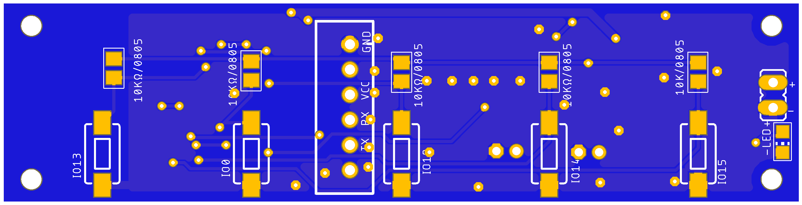
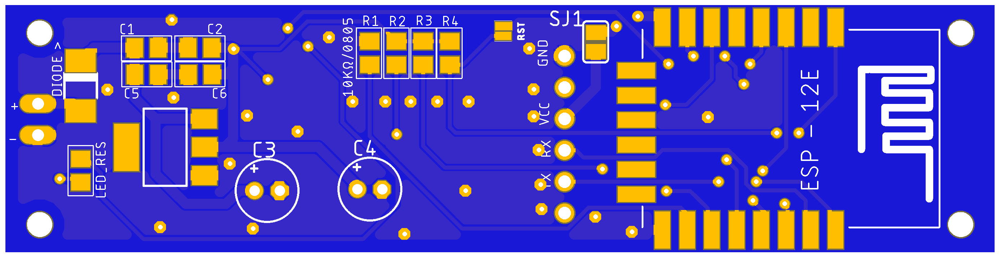

# ESPRemote
### VER 1.1

This repository is a fork of [Almidi's version of ESPRemote](https://github.com/Almidi/ESPRemote), a simple WiFI remote controller using the ESP8266 SoC.

The main difference between his implementation and this fork is about the limit of the input power supply voltage. In his repo, he uses an _[AP2112K](https://www.google.gr/url?sa=t&rct=j&q=&esrc=s&source=web&cd=1&ved=2ahUKEwjnxLrnpvbgAhUEK1AKHWMBD-AQFjAAegQIChAC&url=https%3A%2F%2Fwww.diodes.com%2Fassets%2FDatasheets%2FAP2112.pdf&usg=AOvVaw2XV2W1VE0JfD3LlF0lkARI)_ LDO voltage regulator that has a 6.5V Vin limit, to power it from USB chargers. 

Personally, I have all over in my place 12V power supplies to power led strips, for this reason, it would be a nice touch if I could power it directly from there without the need for an external power supply. So in this fork, the [NCP1117](https://www.onsemi.com/pub/Collateral/NCP1117-D.PDF) or [AMS1117](http://www.advanced-monolithic.com/pdf/ds1117.pdf) voltage regulator is used.

Please check out his [repo](https://github.com/Almidi/ESPRemote) if you want to use the battery/5v dc version, learn more about the beginning version or details about the firmware.

## PCB
### Schematic

### Top

### Bottom

## I/O

| Usage           | Pin    |
|-----------------|--------|
| Button 1        | GPIO5  |
| Button 2        | GPIO4  |
| Button 3        | GPIO12 |
| Button 4        | GPIO0  |
| Button 5        | GPIO13 |
| Status Led      | GPIO16 |

## Enclosure 
I also use [Almidi's](https://github.com/Almidi/ESPRemote) enclosure for this version.

